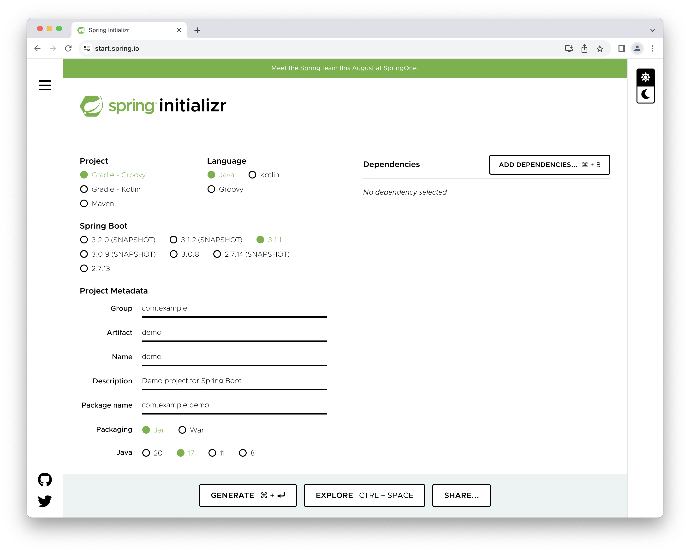

:spring-boot-docs: https://docs.spring.io/spring-boot/docs/current/reference/html
= User Guide

If you're wondering how to use https://start.spring.io or what features are available,
this page is for you! You'll find the various ways you can interact with the service
and get a better insight at what you can do with it.

The service allows you to generate Spring Boot projects quickly. You can customize the
project to generate: the build system and packaging, the language, the packaging,
the coordinates, the platform version and, finally, the dependencies to add to the
project. Most dependencies available on https://start.spring.io are Spring Boot starters
which is the recommended way to add dependencies to a Spring Boot application.

You can interact with the service using the browser at https://start.spring.io of course
but other options are available:

* <<ides,IDEs>> with support for IntelliJ IDEA, Eclipse, NetBeans, and VSCode.
* <<spring-boot-cli,The Spring Boot CLI>>.
* <<command-line,Command-line tools>> such as cURL, HTTPie.

[[getting-started]]
== Getting Started
Let's create a project and discover the various options that you can use to tune it.
Go to https://start.spring.io, change the `Group` field from "com.example" to "org.acme"
and click on "Add Dependencies". This opens a pop-up where you can search for dependencies
to add. If you type "web", you will see a list of matching choices with that simple
criteria. Use the mouse or the arrow keys and `Enter` to select the "Spring Web" starter.

Your browser should now be in this state:

NOTE: The Spring Boot version above probably doesn't match the one you have. The service
is continuously updated as new Spring Boot versions are published and it uses the latest
GA version by default.

Click on "Generate", this downloads a zip file containing a Maven project with the
following structure:

[source]
----
.gitignore
HELP.md
mvnw
mvnw.cmd
pom.xml
src
├── main
│ ├── java
│ │ └── org
│ │     └── acme
│ │         └── DemoApplication.java
│ └── resources
│     ├── application.properties
│     ├── static
│     └── templates
└── test
    └── java
        └── org
            └── acme
                └── DemoApplicationTests.java
----

A typical project contains a Spring Boot application (`DemoApplication`), a test and an
empty configuration. If you run the `main` method of `DemoApplication`, you'll see an
"empty" spring boot app starting on `localhost:8080`.

Based on your selection, a `HELP.md` document contains links to documentation and
samples you can use to learn more about the dependencies you have selected.

Because the conventions have detected it is a web application, the `static` and
`templates` directories have been created to hold your static resources and UI templates.

Also, a Maven wrapper is automatically included so that you don't have to install Maven to
run this project (you can build it with `./mvnw install`). If you prefer, you can select
Gradle instead in the first option at the top of the screen. This will generate a
Gradle-based project that also contains a wrapper which can be used if you don't have
Gradle installed (build it with `./gradlew build`).

[[getting-started-other-options]]
=== Other options
Besides the build system, language and Spring Boot generation, the service exposes a
number of additional options:

* *Group*: project coordinates (id of the project's group, as referred by the `groupId`
attribute in Apache Maven). Also infers the root package name to use.
* *Artifact*: project coordinates (id of the artifact, as referred by the `artifactId`
attribute in Apache Maven). Also infers the name of the project
* *Name*: display name of the project that also determines the name of your Spring Boot
application. For instance, if the name of your project is `my-app`, the generated project
will have a `MyAppApplication` class
* *Description*: description of the project
* *Package Name*: root package of the project. If not specified, the value of the *Group*
attribute is used
* *Packaging*: project packaging (as referred by the concept of the same name in Apache
Maven). start.spring.io can generate jar or war projects
* *Java*: the Java version to use

[[getting-started-dependencies]]
=== Dependencies
The UI allows you to select the Spring Boot version you want to use. You may want to be
conservative and keep the default which corresponds at all times to the latest stable
release. Or you may want to choose a milestone or snapshot of the next major
version. Either way, you'll notice that certain dependencies become available and others
aren't anymore when you change the version.

If you search for a dependency that you know to be available and you get a disabled
panel, it indicates that you cannot use it with the currently selected Spring Boot
version:

[source]
----
Requires Spring Boot >=2.4.0 and <2.6.0-M1
----

Concretely, this defines a "version range" that states the dependency is deprecated and is
no longer available as of Spring Boot 2.6. You may want to check the release notes of the
related project to understand what your migration path can be. Alternatively, the message
could be:

[source]
----
Requires Spring Boot >=2.6.0
----

That version range means the dependency is not available with the selected Spring Boot
generation. If you select Spring Boot 2.6 (or later if available), you'll be
able to select that dependency.

[[sharing]]
== Tuning default values
The service is configured with default values so that you can generate a new project with
minimum fuss. Maybe you are a Kotlin fan? Or a Gradle fan? Currently,
start.spring.io defaults to Java and Maven but it also allows you to tune these defaults
easily. If you are writing a tutorial that requires certain dependencies to be selected,
you can also generate a link that you can use as a reference.

To use this feature, simply use the UI like you would do to create a new project. Once
you're done, click the "Share" button. A pop-up opens with a generated link with a handy
"copy" button to copy the link to your clipboard.

The link contains all settings that are available on start.spring.io. You can shorten it
by removing any attribute that you don't want to enforce. For instance, here is a link
that only changes the `groupId`:

[source]
----
https://start.spring.io/#!groupId=org.acme.test
----

If you copy/paste the link above in your browser, you'll end up on start.spring.io with
the usual UI except that the `Group` field is not equal to the usual `com.example`
default.

NOTE: Any value that is not specified in the link will use whatever default is applicable
once the link is used. If you want to enforce certain values, make sure they are part of
the link.

NOTE: If the Spring Boot version is outdated, the UI will request you to make a choice
and select a supported version.

[[ides]]
== IDEs support
You can generate a project with start.spring.io using all major Java IDEs. This lets you
create and import new projects without having to leave the IDE.

The following IDEs have dedicated support:

* Eclipse/STS
* IntelliJ IDEA (Ultimate Edition)
* NetBeans, using the https://plugins.netbeans.org/plugin/67888/nb-springboot[NB SpringBoot plugin])
* Microsoft VSCode, using the https://marketplace.visualstudio.com/items?itemName=vscjava.vscode-spring-initializr[Spring Initializr Java Support].

Refer to the documentation of your favorite IDE for more details.

[[spring-boot-cli]]
== Spring Boot CLI support
The `spring` command line tool defines an `init` command that allows you to create a
project using Spring Initializr. It defaults to start.spring.io.

Check {spring-boot-docs}/spring-boot-cli.html#cli-init[the documentation for more details].

[[command-line]]
== Command line support
You can also generate a project in a shell using `cURL` or `HTTPie`. To discover the
available options of a particular instance, simply "curl it". If you have `curl`
installed invoke the following:

[indent=0]
----
	$ curl https://start.spring.io
----

Alternatively, if you prefer `HTTPie`, you can discover the available options as follows:

[indent=0]
----
	$ http https://start.spring.io
----

The result is a textual representation of the capabilities of the service that are split
in three sections:

First, a table that describes the available project types. On start.spring.io you can
generate a Maven or Gradle project.

Then, a table that describes the available parameters. For the most part, these are the
same options as the ones available in the web UI. There are, however, a few additional
ones:

* `applicationName` can be used to define the name of the application, disabling the
algorithm that infer it based on the `name` parameter
* `baseDir` can be used to create a base directory in the archive so that you can extract
the generated zip without creating a directory for it first

Finally, the list of dependencies are defined. Each entry provides the identifier that
you'll have to use if you want to select the dependency, a description and the Spring Boot
version range, if any.

Alongside the capabilities of the service, you'll also find a few examples that help you
understand how you can generate a project. These are obviously tailored to the client that
you are using.

Let's assume that you want to generate a "my-project.zip" project based on Spring Boot
`2.6.4`, using the `web` and `devtools` dependencies (remember, those two ids are
displayed in the capabilities of the service):

[source]
----
$ curl https://start.spring.io/starter.zip -d dependencies=web,devtools \
           -d bootVersion=2.6.4 -o my-project.zip
----

If you extract `my-project.zip`, you'll notice a few differences compared to what happens
with the web UI:

* The project will be extracted in the current directory (the web UI adds a base directory
automatically with the same name as the one of the project)
* The name of the project is not `my-project` (the `-o` parameter has no impact on the
name of the project)

The exact same project can be generated using the `http` command as well:

[source]
----
$ http https://start.spring.io/starter.zip dependencies==web,devtools \
           bootVersion==2.6.4 -d
----

NOTE: `HTTPie` reads the same hint as the browser, so it will store a `demo.zip` file in
the current directory with the same differences as discussed above.

